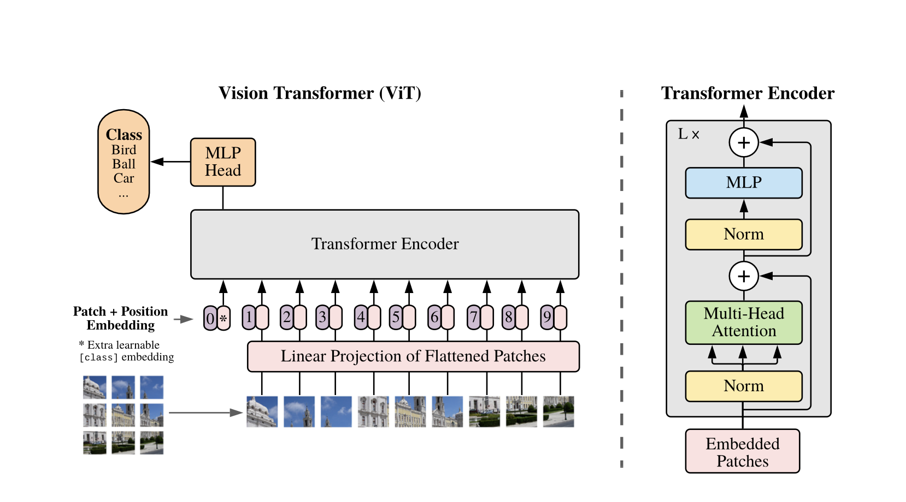
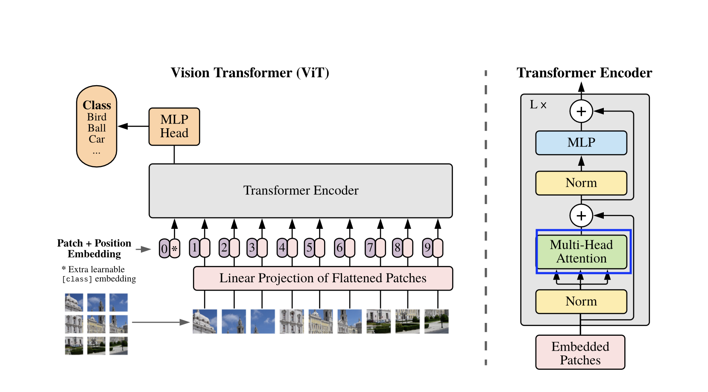
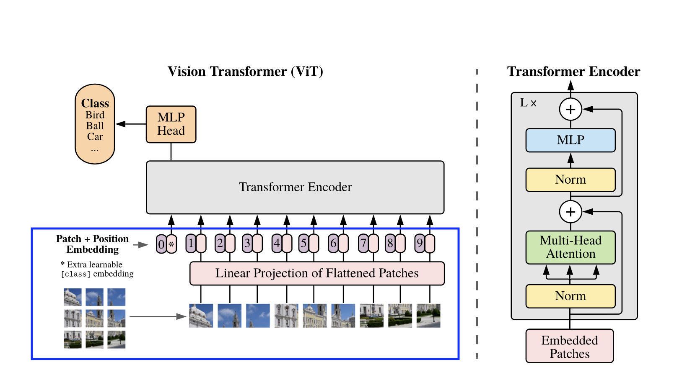
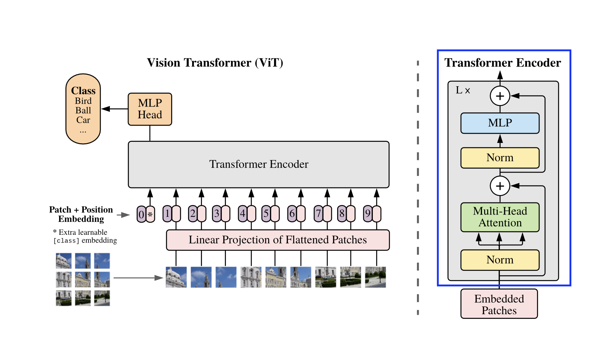
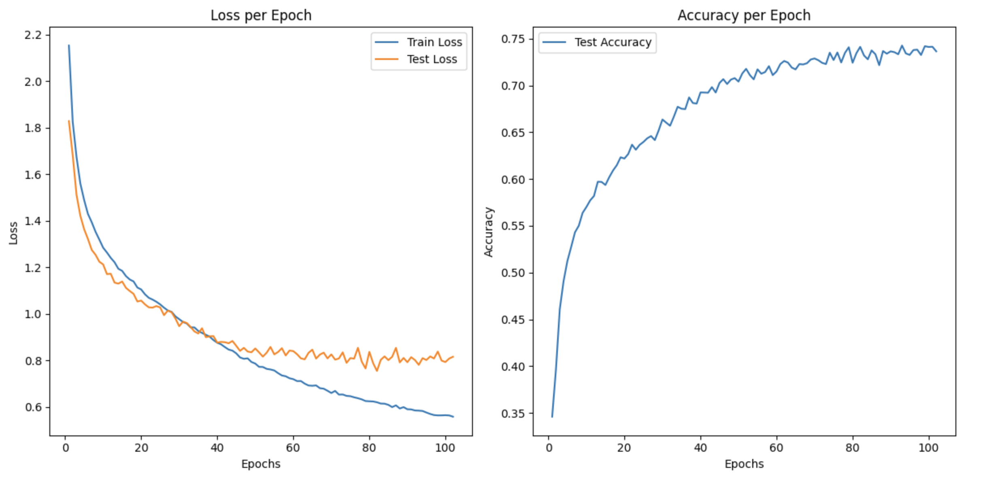

# Vision Transformer (ViT) 
This repository contains an implementation of the **Vision Transformer (ViT)** model in PyTorch, based on the paper ["An Image is Worth 16x16 Words: Transformers for Image Recognition at Scale"](https://arxiv.org/abs/2010.11929v2), published at ICLR 2021.

## Overview

Vision Transformers apply the **transformer architecture** directly to sequences of image patches for image classification, bypassing the need for convolutional layers. By treating image patches as tokens (similar to words in NLP), the transformer model can capture long-range dependencies across the image effectively.

This model architecture is highly effective when trained on large-scale datasets and can outperform convolutional neural networks (CNNs) in terms of accuracy and computational efficiency for image classification tasks.




### Key components of the Vision Transformer:

1. **Patch embedding**: the image is divided into patches (typically 16x16), and each patch is flattened and linearly projected into an embedding space.
2. **Position embedding**: learnable positional embeddings are added to maintain spatial information.
3. **Transformer encoder**: the core transformer block with self-attention and multi-layer perceptrons (MLP) processes the embedded patches.
4. **[CLS] Token**: a classification token is prepended to the patch embeddings and serves as the representation of the entire image for classification.
5. **Classification head**: a simple linear layer maps the output from the [CLS] token to the number of output classes.

### 1. **GELU activation**
The **GELU (Gaussian Error Linear Unit)** activation function used in transformers provides smoother activation compared to ReLU, which improves convergence.

The GELU function is defined as:

GELU(x) = 0.5 * x * (1 + tanh(sqrt(2 / pi) * (x + 0.044715 * x^3)))

```python
class GELUActivation(nn.Module):
    """
    GELU Activation function used in the transformer.
    This is a smooth version of ReLU with improved convergence properties.
    """

    def forward(self, input):
        return 0.5 * input * (1.0 + torch.tanh(math.sqrt(2.0 / math.pi) * (input + 0.044715 * torch.pow(input, 3.0))))
```

### 2. **Multi-Head Self-Attention (MHSA)**



Multi-Head Self-Attention is the core of the transformer model. It computes the relationships between patches by calculating attention scores. 

Given query, key, and value matrices Q, K, and V, the scaled dot-product attention is computed as:

Attention(Q, K, V) = softmax(Q * K^T / sqrt(d_k)) * V

Where `d_k` is the dimensionality of the key vectors.

```python
class MultiHeadAttention(nn.Module):
    """
    This is the core self-attention mechanism. It projects the input to query, key,
    and value vectors and computes the attention scores, which dictate how much
    attention each token should pay to every other token in the sequence.
    """
    def __init__(self, config):
        super().__init__()
        self.hidden_size = config["hidden_size"]
        self.num_attention_heads = config["num_attention_heads"]
        self.attention_head_size = self.hidden_size // self.num_attention_heads
        self.all_head_size = self.num_attention_heads * self.attention_head_size

        # linear layer to project input to query, key, and value vectors (qkv)
        self.qkv = nn.Linear(self.hidden_size, self.all_head_size * 3)

        # dropout for attention probabilities
        self.attn_dropout = nn.Dropout(config["attention_probs_dropout_prob"])

        # linear layer to project attention output back to hidden_size
        self.output_projection = nn.Linear(self.all_head_size, self.hidden_size)

        # dropout for the final attention output
        self.output_dropout = nn.Dropout(config["hidden_dropout_prob"])

    def forward(self, x, output_attentions=False):
        # project input to query, key, and value
        qkv = self.qkv(x)
        # rearrange the qkv output to (batch_size, num_tokens, num_heads, head_size)
        query, key, value = rearrange(qkv, 'b n (three h d) -> three b n h d', three=3, h=self.num_attention_heads)

        # compute attention scores as scaled dot-product of query and key
        attention_scores = torch.einsum('b n h d, b m h d -> b h n m', query, key) / math.sqrt(self.attention_head_size)
        # softmax to get attention probabilities
        attention_probs = nn.functional.softmax(attention_scores, dim=-1)
        # dropout to the attention probabilities
        attention_probs = self.attn_dropout(attention_probs)

        # compute the weighted sum of value vectors
        attention_output = torch.einsum('b h n m, b m h d -> b n h d', attention_probs, value)
        # rearrange the attention output back to (batch_size, num_tokens, hidden_size)
        attention_output = rearrange(attention_output, 'b n h d -> b n (h d)')
        # project the attention output back to hidden_size
        attention_output = self.output_projection(attention_output)
        # apply dropout to the final output
        attention_output = self.output_dropout(attention_output)

        return (attention_output, attention_probs) if output_attentions else (attention_output, None)```
```
### 3. **Patch Embeddings**



The input image is split into non-overlapping patches. Each patch is flattened and projected into a higher-dimensional embedding space using a Conv2D layer.

Given an image of size `H x W x C`, split into patches of size `P x P`, the number of patches is:

N = (H * W) / P^2

Each patch is linearly embedded into a vector of size `D`, resulting in a sequence of patch embeddings.

```python
class PatchEmbeddings(nn.Module):
    """
    This module splits an image into smaller patches and projects each patch into a
    hidden vector space using a Conv2d layer.
    """
    def __init__(self, config):
        super().__init__()
        # image and patch sizes and number of channels
        self.image_size = config["image_size"]
        self.patch_size = config["patch_size"]
        self.num_channels = config["num_channels"]
        self.hidden_size = config["hidden_size"]

        # the number of patches
        self.num_patches = (self.image_size // self.patch_size) ** 2

        # convolution layer to extract patches and project them into hidden_size dimension
        self.projection = nn.Conv2d(self.num_channels, self.hidden_size, kernel_size=self.patch_size, stride=self.patch_size)

    def forward(self, x):
        # conv2d to obtain patch embeddings
        x = self.projection(x)

        # rearrange the output to (batch_size, num_patches, hidden_size)
        x = rearrange(x, 'b c h w -> b (h w) c')
        return x
```
### 4. **Position Embeddings**

To retain positional information, learnable positional embeddings are added to the patch embeddings:

z_0 = [class_token; x_p^1 * E; x_p^2 * E; ... ; x_p^N * E] + position_embeddings

Where `class_token` is the [CLS] token, `E` is the embedding matrix, and `position_embeddings` are the positional embeddings.

```python
class PositionEmbeddings(nn.Module):
    """
    Adds the [CLS] token and positional embeddings to the patch embeddings.
    """
    def __init__(self, config):
        super().__init__()
        # Initialise patch embedding module
        self.patch_embeddings = PatchEmbeddings(config)

        # [CLS] token is added to the sequence for classification tasks
        self.cls_token = nn.Parameter(torch.randn(1, 1, config["hidden_size"]))

        # positional embeddings to retain positional information
        self.position_embeddings = nn.Parameter(torch.randn(1, self.patch_embeddings.num_patches + 1,
                                                            config["hidden_size"]))
        # dropout for regularization
        self.dropout = nn.Dropout(config["hidden_dropout_prob"])

    def forward(self, x):
        # patch embeddings from input images
        x = self.patch_embeddings(x)
        batch_size, num_patches, _ = x.size()

        # repeat [CLS] token for each batch
        cls_tokens = repeat(self.cls_token, '() n d -> b n d', b=batch_size)

        # concatenate the [CLS] token with the patch embeddings
        x = torch.cat((cls_tokens, x), dim=1)

        # add positional embeddings to the sequence
        x = x + self.position_embeddings

        # dropout for regularisation
        x = self.dropout(x)
        return x
```
### 5. **Transformer Encoder**



The encoder consists of alternating layers of multi-head self-attention and MLP blocks. Each layer is followed by **Layer Normalization** and **Residual Connections**.

The operations in a transformer encoder block are:

z' = MultiHeadSelfAttention(LayerNorm(z)) + z z = MLP(LayerNorm(z')) + z'

### 6. **Classification Head**
The final layer of the transformer model takes the [CLS] token output from the transformer and maps it to the number of output classes using a simple linear layer.

## Metrics

